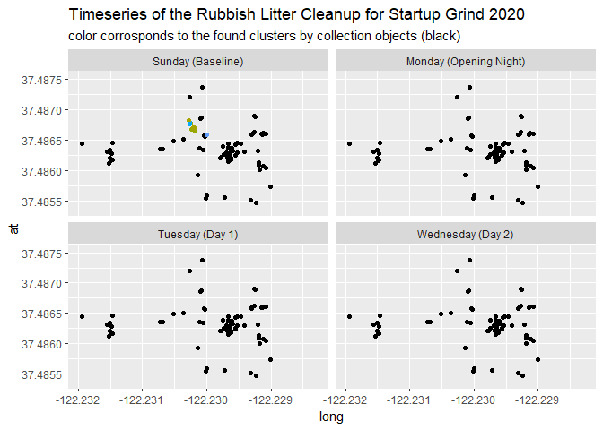

# Welcome

The purpose of this analysis is to look at the clustering of litter for the cleanup done during the Startup Grind 2020 event, by the Rubbish, co. team. We can use clustering to evaluate the placement of collection objects (i.e, trash cans, etc.) and possibly improve on the cleanup policies. We can also use this to gain insights on the habits of people who throw trash on the ground!

This Analysis uses R vizualization and Python scripting together, utilizing the reticulate package. The data was already cleaned using R, [and the script to do so can be found as clean_script.R](https://github.com/Alexander-Kahanek/Rubbish_Clustering/blob/master/clean_script.R). A Python function was also created for the clustering algorithm, [which is located in euclidean_script.py](https://github.com/Alexander-Kahanek/Rubbish_Clustering/blob/master/euclidean_script.py). Both files can be found in my [GitHub Repository for this analysis.](https://github.com/Alexander-Kahanek/Rubbish_Clustering)


This write-up will not be discussing the impacts of litter type and litter production during an event. If you want to see a very well done analysis of the mentioned attributes, [please visit this blog post by Rubbish's Founder, Emin Israfil.](https://www.rubbish.love/blog/the-first-conference-to-audit-its-litter) 

## A little about who Rubbish, co. is

Rubbish, co. is a fresh startup based in California. They recently created the Rubbish iOS Application where you can clean litter and track it! The app allows users to take pictures of the collected item, while simultaniously tracking where the item was collected. The user then self annotates what classification the item belonds to (such as, plastic, paper, tobacco, etc.). They have even created a Rubbish Beam, which is a trash picker-upper dedicated to automatically taking pictures and tracking the litter, making this process easier and faster for the user!

## About Event and Cleanup

Rubbish partnered with Startup Grind and the Fox Theatre Redwood City Team (Team Fox) with a goal to make Startup Grind Global 2020 the first conference in the nation to audit their litter and quantify their litter footprint.

They started the litter audit with a baseline cleanup on Sunday where they found a measly 392 pieces of litter. Monday was the Opening Night Event, and the Rubbish team had gone out to cleanup after the event to find 613 pieces of litter. On Day 1 of the event, Tuesday, Rubbish did another cleanup run after the event where they found 868 pieces of litter. On the second day of the event, Wednesday, they again went out to collect 564 pieces of litter after the days activities.


```{r, warning=FALSE, message=FALSE}
knitr::opts_chunk$set(warning=FALSE, message=FALSE)

####### ALL LIBRARIES USED ###########
###### DATA MANIPULATION ######
options(stringsAsFactors = FALSE)
library(dplyr) # for main data manipulations
library(reticulate) # for python script
library(reshape2) # for dcast()
library(lubridate) # for hours()
source_python("euclidean_script.py") # python script

###### GRAPHING ######
library(RColorBrewer) # for colors in graphs
library(ggplot2) # for lollipop graph
library(gganimate) # for animated time ggplot
library(hrbrthemes) # for ggplot theme
library(sunburstR) # for sunburst graph
library(streamgraph) # for stream graph
library(heatmaply) # for heatmap graph
library(DT) # for data table
######################################


# setup to get all types
collection = c('trashCan', 'recyclingCan', 'tobaccoAshCan')
litter = c('paper', 'tobacco', 'unknown', 'plastic', 'food', 'glass')

# load in cleaned raw data
raw <- read.csv('clean/clean_rubbish.csv') %>% 
  mutate( # change days from shorthand to full
    day = factor(ifelse(day =="Sun", "Sunday",
                        ifelse(day =="Mon", "Monday",
                          ifelse(day == "Tue", "Tuesday", "Wednesday"))),
                 levels = c("Sunday", "Monday", "Tuesday", "Wednesday"))
  )
```

# How much litter was cleaned?

Lets start with getting a baseline for the volume of litter collected on each of our four days.

```{r, fig.height=10}
# prepping data for plot
plot_data<- raw %>% 
  subset(city == 'Redwood City') %>%
  subset(is_litter == 1) %>% 
  group_by(rubbishType, day) %>% 
  summarise(
    num_litter = n()
  ) %>% 
  group_by(day) %>% 
  arrange(-num_litter) %>% 
  ungroup() %>% 
  arrange(day, num_litter) %>% 
  mutate(order = row_number())

# plotting lollipop graphs
plot_data %>% 
  ggplot() +
  geom_segment( aes(x=order, xend=order, y=0, yend=num_litter), color="pink", size = 1.5) +
  geom_point( aes(x=order, y=num_litter, color="pink"), size=5 ) +
  coord_flip()+
  theme_ipsum() +
  theme(
    panel.grid.minor.y = element_blank()
    ,panel.grid.major.y = element_blank()
    ,legend.position = "none"
    ,panel.border = element_blank()
    ,panel.spacing = unit(0.1, "lines")
    ,strip.text.x = element_text(size = 15)
  ) +
  xlab("") +
  ylab("Pieces of Litter Collected") +
  labs(title = "Total Litter Collected by Rubbish Team"
       ,subtitle = "during the Startup Grind 2020 Conference"
       ) +
  facet_wrap(~day, ncol=1, scale="free_y") +
  scale_x_continuous(
    breaks = plot_data$order
    ,labels = plot_data$rubbishType)
```

From this we can see a clear increase in litter pickup for Tuesday and Wednesday. The higher volume of collected litter is expected as the actual event took place over these two days. However, we see a drastic spike in paper collected on Tuesday. These are most likely made up by event fliers being handed out and later dropped on the floor. In total, we know that 2437 objects were collected, and there were a total of 42 tagged collection objects throughout all four days.


# What about Collection Objects?

Collection Objects are defined to be Trash Cans, Recycling Cans, and Tobacco Ash Cans.

For our clustering algorithm, we will define the allowable items into each collection object.

+ i.e, only tobacco products can be clustered into Tobacco Ash Cans, recycling products into Recyclying Cans, and everything is allowable into Trash Cans.

From here, we will cycle through each tracked item and find its closest allowable collection point, via straight line distance with an adjustment for longitude and latitude. This item will then be considered part of that collection points cluster.

[This script was created in Python and saved as euclidean_script.py](https://github.com/Alexander-Kahanek/Rubbish_Clustering/blob/master/euclidean_script.py), which can be found in my [GitHub repository for this analysis](https://github.com/Alexander-Kahanek/Rubbish_Clustering). The Python script is being used directly in R as a callable function using the Reticulate package! We could have also created the function directly in the R Markdown file; however, it is much easier to just import it directly as a function. So lets cluster our items!


```{r}
# clustering data points with python script
clustered_data <- raw %>% 
  subset(city == 'Redwood City') %>% # this is a different area
  get_euclidean(collection, litter) # python function

#########################
# CLUSTERING PREFORMED

# getting details on clustered data
clusters <- clustered_data %>% 
  subset(is_litter == 1) %>% # only want objects
  group_by(closest_cent, day) %>% 
  summarise(
    cent_type = max(cent_type)
    ,num_litter = n()
    ,mean_dist = round(mean(distance),2)
    ,median_dist = round(median(distance),2)
    ,sd_dist = round(sd(distance),2)
    ,max_dist = round(max(distance),2)
    ,lat = mean(lat)
    ,long = mean(long)
  ) %>% 
  arrange(-num_litter)
```


## What do our clusters look like?

After applying our clustering algorithm with a Python script, we find the following clusters.


```{r}

clustered_data %>% 
  mutate(
    closest_cent = paste(ifelse(cent_type == "trashCan", "Trash:",
                                ifelse(cent_type == "recyclingCan", "Recyc", "Ash")),
                         ifelse(closest_cent<10, paste("0",closest_cent, sep=""), closest_cent),
                         sep= " ")
  ) %>%
  filter(cent_id == -1) %>% 
ggplot(aes(x= long, y=lat, color= closest_cent)) + 
  geom_point() + 
  geom_point(data = clustered_data %>% 
               filter(cent_id != -1),
             aes(x= long, y=lat)
             ,colour = "black"
             ,size = 2.5
             ) + 
  theme(legend.position = "none") + 
  labs(title= "Clustering groups of litter for the Rubbish Cleanup"
       ,subtitle = "color corrosponds to the found clusters by collection objects (black)"
       )

```

From the above scatter plot we see that the black dots corrospond to the collection objects. Our colored dots are the objects the Rubbish Team collected throughout all 4 days. The larger cluster of black dots are collection objects located inside the bathrooms in the building. This throws things off a bit, and in the future I would suggest Rubbish to distinguish which collection objects are located inside bathrooms, so that we can aggregate the results. However, since there is no inclination of which are inside or outside of the bathroom, they will all be treated as they are given.

For the clusterings, we actually see pretty good groupings! Although it is clear the placements of the collection objects could be improved to better cover the areas defined. Unfortunately, without any idea of how full these collection objects were, there would not be anything fruitful gained from trying to find better locations for the collection objects. As it is unclear if clusters with a high volume of litter is due to high foot traffic, or if it is due to an overfilled collection object.


## Did the Rubbish Team have an effect?

To see if the Rubbish team had an effect on the clustering, we should look where they were focused for each hour. To do this, a streamgraph gives us the best representation. The overall length of each block gives us the total number of litter pieces picked up and tracked by the rubbish team!

```{r, fig.cap="This graph represents the amount of litter collected per hour, for each collection object."}
get_hour <- function(time){
  # function used to save space
  return (hour(as.POSIXct(time, format="%Y-%m-%d %H:%M:%S")))
}

# getting plot data for streamgraph
plot_data <- clustered_data %>% 
  subset(is_litter==1) %>% # only want objects
  mutate( # getting hours of days, and making them concurrent
    time = ifelse(day=="Sunday", get_hour(time),
                  ifelse(day=="Monday", get_hour(time)+24,
                         ifelse(day=="Tuesday", get_hour(time)+48,
                                get_hour(time)+72))),
    # make graph prettier
    closest_cent = paste(ifelse(cent_type == "trashCan", "Trash ID:",
                                ifelse(cent_type == "recyclingCan", "Recyc ID:", "Ash ID:")),
                         ifelse(closest_cent<10, paste("0",closest_cent, sep=""), closest_cent),
                         sep= " ")
  ) %>% 
  group_by(closest_cent, time) %>% 
  summarise(
    num_litter = n()
    # ,day = day
  ) %>% 
  ungroup() %>% 
  rbind(data.frame("closest_cent" = NA, "time" = c(1:100), "num_litter" = 0)) %>% 
  group_by(closest_cent, time) %>% 
  summarise(
    num_litter = sum(num_litter)
  ) %>% 
  ungroup() %>% 
  arrange(-time)
 
# plotting Streamgraph
plot_data %>%
  streamgraph(
    "closest_cent", "num_litter", "time"
    ,interpolate="step", #offset = "zero",
    scale = "continuous", width="800px", height="400px"
            ) %>%
  sg_legend(show=TRUE, label="Collection ID: ") %>%
  sg_fill_manual(brewer.pal(9, "RdPu")) %>% # [c(3:9)]) %>%
  sg_annotate("Collected Litter per Hour", "300px", "400px")
  
```

Each seperation of color corrosponds to a different collection object. Colors are repeated as there are too many collection objects to create distinct colors. 

From the above we can decipher when the Rubbish team was at the location in cleanup-mode in full force. We see drastic spikes in the volume of collected litter. This could mean that litter collection was not consistent across the whole event, meaning they cleaned in certain time segments instead of during the entire event. However, this could also mean there was generally less litter during the times of lower volumes. After talking to the Rubbish team, the reality is they did their cleaning after the event was coming to a close. My suggestion would be to focus on cleaning during the entire event, in order to lessen the bias on a time-scale. Due to this bias in collection times, any analysis on the litter produced over time would have a major bias and could easily misrepresent reality.

Another point is we can see larger volumes of litter around certain collection objects during these timeblocks. This could be due to a larger build-up over litter around these areas, or it could be due to the Rubbish team lingering and favoring certain collection object locations. It is difficult to tell from this graph, so to find how the team collected their litter we can create a time map of all the litter they collected!

## Viewing the collection over time

To get an idea of how well the RUbbish team traversed the event space, we can look at the collection of litter one point at a time.


```{r}

dots <- clustered_data %>% 
  filter(cent_id > -1)

dots <- dots %>% 
  rbind( dots %>% mutate(day="Sunday")) %>% 
  rbind( dots %>% mutate(day="Monday")) %>% 
  rbind( dots %>% mutate(day="Tuesday"))

time_plot <- clustered_data %>%
  mutate(
    closest_cent = paste(ifelse(cent_type == "trashCan", "Trash:",
                                ifelse(cent_type == "recyclingCan", "Recyc", "Ash")),
                         ifelse(closest_cent<10, paste("0",closest_cent, sep=""), closest_cent),
                         sep= " ")
  ) %>%
  mutate(
    time = as_datetime(time)
    ) %>%
  arrange(time) %>%
  mutate(
    id = row_number()
  ) %>%
  filter(cent_id == -1) %>%
ggplot() +
  geom_point(data= dots
             ,aes(x=long, y=lat)
             ,color="black"
             ,size = 1.5) +
  geom_point(aes(x= long, y=lat, group=id, color= closest_cent)) +
  theme(legend.position = "none") +
  facet_wrap(~day) +
  labs(title = 'Timeseries of the Rubbish Litter Cleanup for Startup Grind 2020'
       ,subtitle = "color corrosponds to the found clusters by collection objects (black)"
       ) +
  transition_reveal(id)

anim_save("rubbish.time_collection.gif", time_plot)
```



From the above gif we can see how rubbish well the Rubbish team moved around the area to collect the litter. If you look closesly, you can even tell how many people were picking up litter at the same time.

It seems there is some lingering around some areas; however, this could have easily been due to a higher volume of litter in these areas. The Rubbish team also did not pick up any litter in the lower left area, yet collection objects were tagged there.

## Well, how close was the litter to Collection Objects?

One important feature is finding how close litter was, on average, to its closest collection point. This feature could point clues to how lazy humans are! If the average distance to the collection object is low, then that means people are pretty lazy. However, if the average distance is large, this could mean that a collection object was not close enough for the person to reasonably throw away their litter. Of course, we should all just hold onto our trash a little longer to actually throw it away.

One important note is that this has an inherent bias. We, again, do not know how full these collection objects are. Meaning, people could have looked for a appropriate collection object; however, did not find any with enough room to throw away their trash. Or they might have even thrown their trash away, but because they were full the trash had fallen out of its collection object.


```{r}
# prepping data for heatmap plot
plot_data <- clusters %>%
  mutate(
    closest_cent = paste(ifelse(cent_type == "trashCan", "Trash:",
                                ifelse(cent_type == "recyclingCan", "Recy:", "Ash:")),
                         ifelse(closest_cent<10, paste("0",closest_cent, sep=""), closest_cent),
                         sep= " ")
  ) %>% 
  subset(select = c(day, closest_cent, mean_dist)) %>% 
  dcast(closest_cent ~ day, value.var = "mean_dist") %>% 
  mutate( # chaning na values to 0
    Sunday = ifelse(is.na(Sunday),0,Sunday)
    ,Monday = ifelse(is.na(Monday),0,Monday)
    ,Tuesday = ifelse(is.na(Tuesday),0,Tuesday)
    ,Wednesday = ifelse(is.na(Wednesday),0,Wednesday)
  )

# changing rownames to centroid id
rownames(plot_data) <- plot_data[,"closest_cent"]

# making dataframe into matrix
plot_data <- plot_data %>% 
  subset(select = -c(closest_cent)) %>% 
  as.matrix()

# colors for graph
colors <- brewer.pal(9, "RdPu")[c(1, 6:9)]
colors[1] <- "#ffffff"

# row clustering order
row_order <- plot_data %>% 
  dist(method = "euclidean") %>% 
  hclust(method = "complete") %>% 
  as.dendrogram() %>% 
  rev()


# plotting heatmap
plot_data %>% 
  heatmaply(
          plot_method = "plotly"
          ,colors = colorRampPalette(colors)
          ,dendogram = "both"
          ,show_dendrogram = c(FALSE, FALSE)
          ,label_names = c("Day", "Collection ID", "Mean Distance")
          ,grid_color = "white"
          ,main = "Mean Distance of Litter from the (Trash / Recyclying / Ash) Can"
          #ylab = "Collection Objects (ID)",
          ,xlab = "A distance of 0 means there are no objects around the Collection Object."
          ,key.title = "meters"
          ,showticklabels = c(TRUE, TRUE)
          ,column_text_angle = 0
          ,colorbar_len = .8
          ,grid_gap = 1
          ,Rowv = row_order
          ,Colv = clustered_data$day %>% unique()
          # ,cellnote = plot_data
          ) %>% 
  layout(width=800)
```

From the above we can see that most collection objects were fairly consistent with its average distance of surrounding litter. We see that some collection objects, namely the top ID's, having a large distance, while the lower part of the graph has a very low average distance. These disparities could be due to human laziness, the "fullness" of the collection object, or the amount of foot-traffic in the area. 

Along with this, we found 6 out of our total 42 collection objects to have a mean distance of more than 20 meters, when summing the distance across all four days. This leads us to believe that at least 6 of these collection objects could be moved to better locations to accomodate the events participants.

## But what about the number of items per cluster?

To get an idea of this, let's take the exact same heatmap, but look at the count of items found near each collection object.

```{r}
# prepping data for heatmap plot
plot_data <- clusters %>%
  mutate(
    closest_cent = paste(ifelse(cent_type == "trashCan", "Trash:",
                                ifelse(cent_type == "recyclingCan", "Recy:", "Ash:")),
                         ifelse(closest_cent<10, paste("0",closest_cent, sep=""), closest_cent),
                         sep= " ")
  ) %>% 
  subset(select = c(day, closest_cent, num_litter)) %>% 
  dcast(closest_cent ~ day, value.var = "num_litter") %>% 
  mutate( # chaning na values to 0
    Sunday = ifelse(is.na(Sunday),0,Sunday)
    ,Monday = ifelse(is.na(Monday),0,Monday)
    ,Tuesday = ifelse(is.na(Tuesday),0,Tuesday)
    ,Wednesday = ifelse(is.na(Wednesday),0,Wednesday)
  )

# changing rownames to centroid id
rownames(plot_data) <- plot_data[,"closest_cent"]

# making dataframe into matrix
plot_data <- plot_data %>% 
  subset(select = -c(closest_cent)) %>% 
  as.matrix()

# colors for graph
colors <- brewer.pal(9, "RdPu")[c(1, 6:9)]
colors[1] <- "#ffffff"

# plotting heatmap
plot_data %>% 
  heatmaply(
          plot_method = "plotly"
          ,colors = colorRampPalette(colors)
          ,dendogram = "both"
          ,show_dendrogram = c(FALSE, FALSE)
          ,label_names = c("Day", "Collection ID", "Number of Litter")
          ,grid_color = "white"
          ,main = "The count of Litter for each (Trash / Recyclying / Ash) Can"
          #ylab = "Collection Objects (ID)",
          ,xlab = "A distance of 0 means there are no objects around the Collection Object."
          ,key.title = "# of litter"
          ,showticklabels = c(TRUE, TRUE)
          ,column_text_angle = 0
          ,colorbar_len = .8
          ,grid_gap = 1
          ,Rowv = row_order
          ,Colv = clustered_data$day %>% unique()
          # ,cellnote = plot_data
          ) %>% 
  layout(width=800)
```

From this we can see that most collection objects have about 10-20 pieces of litter near it; however, some of them have well over 100. This tells could tell us a few things: the collection objects with higher counts had more traffic, they were fuller than others (meaning litter fell out of them), or people were lazier in those areas.

Most importantly though, we really don't know why this is the case. But, we can try to see if there is a connection between the count of litter per cluster, and the average distance of litter.

## Is there a connection between the average distance and the amount of litter?

To get an idea, lets look at some simple point plots, seperated by days as thats when each of these clusters are cleaned.

```{r}
# prepping data for heatmap plot
plot_data <- clusters %>%
  mutate(
    closest_cent = paste(ifelse(cent_type == "trashCan", "Trash:",
                                ifelse(cent_type == "recyclingCan", "Recy:", "Ash:")),
                         ifelse(closest_cent<10, paste("0",closest_cent, sep=""), closest_cent),
                         sep= " ")
  ) %>% 
  subset(select = c(day, closest_cent, num_litter, mean_dist))

plot_data %>% 
  ggplot() + 
  facet_wrap(~day) +
  geom_point(aes(x = num_litter, y = mean_dist, color= closest_cent)) + 
  theme(legend.position = "none") + 
  xlab("The total count of litter found for each collection object") + 
  ylab("The average distance of litter from the collection object") + 
  labs(title = "The distribution of the amount of litter found near a collection object\n and the litters average distance away.")

```

From this, we initially see no correlations. It appears there is a weak, positive, correlation on Wednesday. However, nothing looks convincing. None-the-less, let's check out the Pearson Correlation R values.

```{r}
for (day_r in clustered_data$day %>% unique()){
  print(day_r)
  
  plot_data %>% 
    subset(day == day_r) %>% 
  subset(select = c(num_litter, mean_dist)) %>% 
  cor() %>% 
    # power(2) %>% 
    print()
}


```

Here we can see the correlation values for each day. Again, nothing convincing, but we can see a weak correlation between the two variables on Wednesday. In general, this tells us that there does not seem to be an influence of how much litter is already around the area and a persons decision to get their litter closer to the collection object.

## Searchable data table of clusters

Here is a searchable data table to view the clusteringss yourself, along with some basic statistics for each!

```{r}
# getting data for data table
clustered_data %>% 
  subset(obj_id != -1) %>% # only want objects
  group_by(closest_cent) %>% 
  summarise(
    cent_type = max(cent_type)
    ,num_litter = n()
    ,mean_dist = round(mean(distance),2)
    ,median_dist = round(median(distance),2)
    ,sd_dist = round(sd(distance),2)
    ,max_dist = round(max(distance),2)
  ) %>% 
  arrange(-num_litter) %>% 
  rename( # renaming columns
    "Collection ID" = closest_cent
    ,"Collection Type" = cent_type
    ,"Number of Litter" = num_litter
    ,"Mean Distance (m)" = mean_dist
    ,"Median Distance (m)" = median_dist
    ,"Standard Deviation (m)" = sd_dist
    ,"Max Distance (m)" = max_dist
  ) %>% 
  # plotting data table
  datatable()
```

In total we have 42 collection objects. The average distance of the litter to the nearest collection object is on average 12.28 meters. From this we can assume that the average person drops their trash on the ground if they are a measly 12 meters away from the closest trash can. That is about 40 feet for us American folks. This means that event venues should place their trash collection objects in 40 foot intervals to maximize their effectiveness.

# What does this all mean? 

In summary, we found the that 14% of our 42 collection objects had an average distance of more than 20 meters. Suggesting that most collection objects had a good placement to collect as much trash as possible. We also found the average person drops their trash on the ground if a collection object is about 12 meters away. 

Based on the clustering map, we can visually see that the clusters are grouped together well and none are excessively large. Unfortunately, not much could be gained from the time-series aspect of the litter produced over time, due to a clear (unintended) bias from the Rubbish team collecting litter in bursts, as opposed to consistently throughout the event.

We noted an extreme increase in paper-based litter being collected during the first day of the event. This is most likely due to flyers being handed out to the even participants. In the future, things like this could be avoided by placing more strategic trash cans.

Finally, we also found that statistically speaking, there does not seem to be an influence of how much litter is already around the area and a persons decision to get their litter closer to the collection object.

In general, we found some pretty awesome insights. However, there are a few inherent biases due to how the data was collected which severly limited the scope on the analysis. If these biases are addressed, much more could be done. Such as, finding the optimal collection object placements to minimize the amount of litter, hopefully finding more correlations on why people litter, designing a way to measure the efficacy of collection objects, finding the litter patterns of people during the event timeline, and lastly, helping keep the world a cleaner rock to live on!

## My recomendations for litter data collection during events

To decrease time based biases litter should be collected consistently throughout the events day. This not only helps keep litter off the ground, but it helps show the trends of how litter is being produced over time. This can help immensely by seeing where litter collection might be better focused. For example, if a conference is happening, would it be fruitful to move a Recycling bin near the entrance for participants to discard their flyers on entrance or exit? Or would this prove useless? Would it be useful to move trash cans to the exits of the buildings before the events close? Questions like these could be answered with a full-scale time series.

To decrease bias in collection areas, try and spread out the collection team. Avoid team members collecting in the same areas at the same time. This will help get a better scope of litter across the whole event space, as opposed to specific areas. This improvement could help distinguish which areas are truly high or low volume areas, as well as help with distinguishing foot traffic and the corrosponding litter produced throughout the entire event. These insights could help venues focus cleanup efforts in specific areas when they know a high volume of litter will be produced.

Finally, to get a full scope of the trash collected during an event, data should be collected two days before the event and two days after the event. This would serve as a good baseline, to get an idea of how the event effect litter production in the short-term. Also, litter collection objects (i.e, Trash Can, etc.) should be logged, in percentage form, for how full a certain collection object is at that time. For example, at 2:00pm trash can #3 was 50% full. The team should also measure the amount of trash thrown away, into collection objects, by participants. This can be done by physically weighing the amount of trash from a collection object. This would be much easier than counting every object thrown away. These insights could help tremendously with finding ideal locations for the collection objects. Without the knowledge of how full these objects were, everything is speculation. For example, a high litter area could be due to large amounts of foot trafffic, or a full trash can. Both are drastically different circumstances and would be fixed in very different ways. This could help answer questions such as: how impactful is the placement of trash cans? Are there correlations between how full a trash can is and how much litter is produced around it? Are there correlations between the average distance of litter to a trash can and how full it is? How impactful are dedicated tobacco ash Cans, compared to a trash can?

# Extras

## Sunburst graph of clustering

Finally, I will leave you with this fun sunburst graph to play with. You can hover over each section to further subset the clusters by type of objects surrounding the collection objects, then further by the amount of that type collected on each respective day. Have fun!

```{r}
# getting data for sunburst plot
sunburst <- clustered_data %>% 
  subset(is_litter == 1) %>% 
  group_by(cent_type, day, rubbishType) %>% 
  summarise(
    num_litter = n()
  ) %>% 
  mutate( # path is needed for plot
    path = paste(cent_type, rubbishType, day, sep="-")
  ) %>% 
  subset(select = c(path, num_litter)) %>% 
  # plotting suburst graph
  sunburst(legend=TRUE
           ,colors = rev(brewer.pal(9, "RdPu")[4:9])
           ,count = TRUE
           ,breadcrumb = list(w=150,h=50, t=30)
           ,sumNodes = TRUE
           )
sunburst
```

-------------------------

-------------------------

-------------------------

-------------------------

-------------------------

Below are the code chunks for the statistics used throughout this analysis. They are shoved to the bottom, so not to muddy up the written portion.


total number of collection objects


```{r}
# finding the number of collection objects with a average distance greater than 20 meters

nDistance <- clusters %>%
  mutate(
    closest_cent = paste(ifelse(cent_type == "trashCan", "Trash:",
                                ifelse(cent_type == "recyclingCan", "Recyc", "Ash")),
                         ifelse(closest_cent<10, paste("0",closest_cent, sep=""), closest_cent),
                         sep= " ")
  ) %>% 
  subset(select = c(day, closest_cent, mean_dist)) %>% 
  dcast(closest_cent ~ day, value.var = "mean_dist") %>% 
  mutate( # chaning na values to 0
    Sunday = ifelse(is.na(Sunday),0,Sunday)
    ,Monday = ifelse(is.na(Monday),0,Monday)
    ,Tuesday = ifelse(is.na(Tuesday),0,Tuesday)
    ,Wednesday = ifelse(is.na(Wednesday),0,Wednesday)
  )

# changing rownames to centroid id
rownames(nDistance) <- nDistance[,"closest_cent"]

# adding a summation, and deselecting columns
nDistance <- nDistance %>% 
  subset(select = -c(closest_cent)) %>% 
  mutate(
    sum = (Sunday+Monday+Tuesday+Wednesday)/4
  ) 

###############
# total number of collection objects
nDistance %>% nrow()
```


total number of objects with a average distance greater than 20 meters


```{r}
###############
# total number of objects with a average distance greater than 20 meters
nDistance %>% 
  filter(sum > 20) %>% 
  nrow()
```


total units of litter collected


```{r}
############
# total units of litter collected
raw %>% 
  filter(is_litter == 1) %>% 
  nrow()
```


number of litter collected for each day


```{r}
raw %>% 
  filter(is_litter == 1) %>% 
  group_by(day) %>% 
  summarise(
    n = n()
  ) %>% 
  head()
```


the head of the raw data


```{r}
raw %>% head()
```


average distances to clusters for each day


```{r}
nDistance <- clusters %>%
  mutate(
    closest_cent = paste(ifelse(cent_type == "trashCan", "Trash:",
                                ifelse(cent_type == "recyclingCan", "Recyc", "Ash")),
                         ifelse(closest_cent<10, paste("0",closest_cent, sep=""), closest_cent),
                         sep= " ")
  ) %>% 
  subset(select = c(day, closest_cent, mean_dist)) %>%
  dcast(closest_cent ~ day, value.var = "mean_dist") %>%
  mutate( # chaning na values to 0
    Sunday = ifelse(is.na(Sunday),0,Sunday)
    ,Monday = ifelse(is.na(Monday),0,Monday)
    ,Tuesday = ifelse(is.na(Tuesday),0,Tuesday)
    ,Wednesday = ifelse(is.na(Wednesday),0,Wednesday)
  )

# changing rownames to centroid id
rownames(nDistance) <- nDistance[,"closest_cent"]


# making dataframe into matrix
nDistance <- nDistance %>%
  subset(select = -c(closest_cent)) %>%
  mutate(
    sum = (Sunday+Monday+Tuesday+Wednesday)/4
  )

# nDistance %>% head(50)

nDistance %>%
  summarise(
    nCollection_Objects = n()
    ,avg_dist_Sun = mean(Sunday)
    ,avg_dist_Mon = mean(Monday)
    ,avg_dist_Tue = mean(Tuesday)
    ,avg_dist_Wed = mean(Wednesday)
    ,avg_dist_Total = mean(sum)
  )
```

